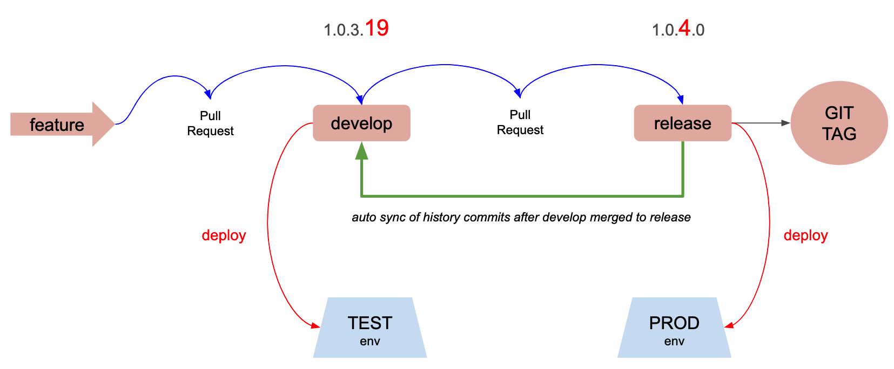
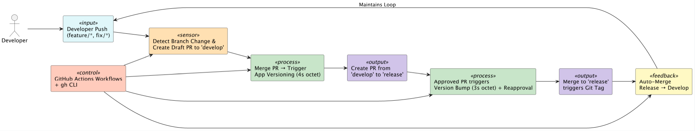

# 📘 Customised Git Flow – Cybernetic System Theory Perspective

This repository implements a **Customised Git Flow** powered by **GitHub Actions** and framed through the lens of **General Systems Theory** and **Cybernetics**. It automates development workflows including pull request creation, versioning, approvals, tagging, and synchronization between branches using feedback control mechanisms.

---

## 🔄 Git Flow Steps as Feedback Loop

1. **Developer pushes** to `feature/*` – Auto PR to `develop` is created.
2. PR merge to `develop` triggers **4-octet** version bump (`1.0.3.18 → 1.0.3.19`).
3. Manual PR is made from `develop` to `release`.
4. Once reviewed, automation checks if commit was made by GitHub Actions and **re-approves** if needed.
5. PR merge to `release` triggers **3-octet** bump (`1.0.3.19 → 1.0.4.0`) and **Git Tag** (`v1.0.4.0`).
6. The `release` branch is **merged back into `develop`**, closing the loop.

---

## 📈 Versioning Strategy

| Action                                | Version Outcome         |
|--------------------------------------|--------------------------|
| Merge to `develop`                   | Bump 4th octet (BUILD)  |
| Approved PR to `release`             | Bump 3rd octet (PATCH), reset BUILD |
| Git Tag                              | Created from `release` branch |
| Release merged back to `develop`     | Maintains version alignment |

---

## 📦 Key Workflows

- **Auto PR Creation** from `feature/*` to `develop`
- **4-Octet Version Bump** on PR merge to `develop`
- **3-Octet Version Bump** on PR approval into `release`
- **Auto Re-approval** logic for bot-generated commits
- **Git Tagging** using the incremented version
- **Feedback Merge** from `release` to `develop`

---

## 📎 Visual Diagrams – Git Flow

### 🔁 Git Flow Feedback with Version Sync & Environments

This diagram visualizes the Git branching model with semantic version bumps and links to TEST and PROD environments:

**Highlights:**
- `feature → develop` → triggers TEST deployment.
- `develop → release` → triggers PROD deployment.
- `release` branch creates Git tags.
- Auto-history sync from `release` back into `develop`.

---

## 🌐 Benefits of the Cybernetic Design

- 🔁 **Self-regulating** versioning system  
- 🔍 **Continuous verification** of state and integrity  
- 🤖 **Autonomy** with minimal human intervention  
- 🔒 **Consistent release tags and audit trail**  
- 🔧 **Extensible for multi-service and mono-repos**

---

## 🧪 Ideal Use Case

- DevOps teams managing multiple services  
- Projects needing strict version tracking  
- Environments enforcing automated GitOps workflows  
- Teams requiring feedback mechanisms for Git history consistency

---

## ⚙️ System Theory Foundations

In **Systems Theory**, any dynamic system can be represented with the interaction of Inputs, Processes, Outputs, and Feedback. The **Customised Git Flow** follows this exact model:

| Element         | Description                                                                 |
|-----------------|-----------------------------------------------------------------------------|
| **System**      | The GitHub repository (with `feature`, `develop`, `release`) branches      |
| **Inputs**      | Code pushes, pull requests, reviews, approvals                             |
| **Processes**   | GitHub Actions automate checks, versioning, merging, tagging                |
| **Outputs**     | Tagged releases, deployed services                                          |
| **Controller**  | GitHub Actions, Shell scripts, `gh` CLI                                     |
| **Sensors**     | Version consistency checks, PR state observers                              |
| **Feedback**    | Auto re-approval logic and merge `release → develop` to maintain sync      |

---

## 🔁 Cybernetic Control Loop

This Git Flow is modeled as a **closed-loop feedback system** where every action generates feedback that influences subsequent actions. This ensures the system stays in a consistent and healthy state.

### 📋 Control Loop Elements

| Component        | Role                                                                 |
|------------------|----------------------------------------------------------------------|
| **Setpoint**     | Consistent versions and synchronized branches                        |
| **Disturbance**  | Merged features with inconsistent versions or skipped approvals      |
| **Sensors**      | Workflows that validate `.csproj` versions and PR approvals          |
| **Controller**   | GitHub Actions YAML + Shell Logic                                    |
| **Effectors**    | Auto PR creation, version commits, Git tags                          |
| **Feedback**     | Auto-merge from `release` to `develop`, re-approval after auto-commits|

---

## 📎 Visual Diagrams – Cybernetics

### 🧠 Cybernetic Control Loop

This diagram represents the system as a **closed feedback loop**, where developer actions trigger automation via GitHub Actions, forming a self-regulating cycle of pull requests, versioning, tagging, and synchronization:

**Highlights:**
- Developer pushes trigger draft PRs to `develop`.
- Merge to `develop` → 4th octet version bump.
- Merge from `develop` to `release` → 3rd octet bump + Git tag.
- GitHub Actions serves as the controller and effector.
- Auto-feedback loop: `release → develop`.

---

## 📬 Feedback

Feel free to contribute ideas and suggestions for improving the automation loop or extending this Git Flow to fit other branching models.

---
